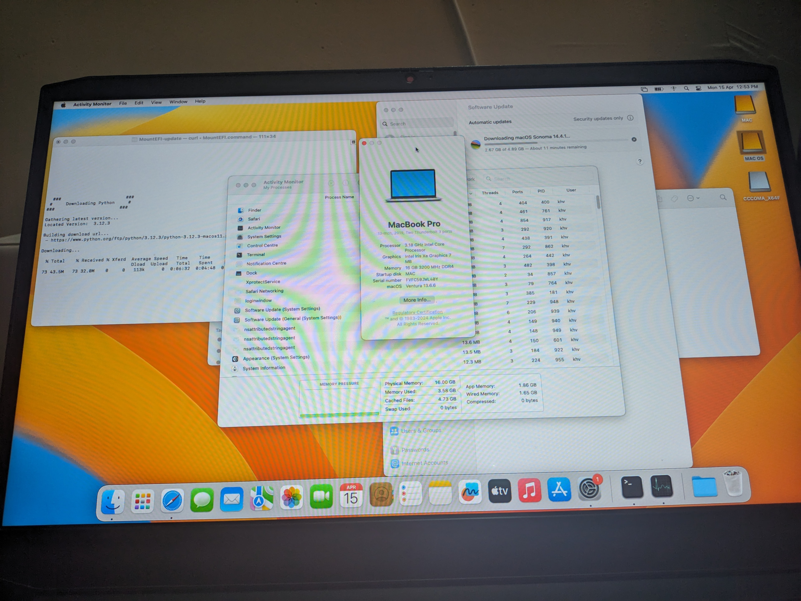

# Lenovo IdeaPad Gaming 3 (Tiger Lake) Hackintosh EFI

## Intro

This repository contains my EFI configuration used to create a bootable Hackintosh installation for the Lenovo IdeaPad Gaming 3 laptop featuring a Tiger Lake CPU.

## Disclaimer

Hackintosh installations are complex and compatibility is not guaranteed. I provide this EFI folder as-is.  Use at your own risk! I take no responsibility for any problems that might occur with your system. Hackintosh projects are best suited for experienced users.

## Compatibility

- Device Model: Lenovo Ideapad Gaming 3 15IHU6 (or other closely matching Ideapad Gaming 3 Tiger Lake models)
- CPU: Intel Core i5 11320H Tiger Lake Processor
- GPU: GTX1650 (Note: iGPU support for Tiger Lake is limited)
- RAM: 16GB
- Storage: 1TB Nvme

Please refer to the [Dortania OpenCore Install Guide](https://dortania.github.io/OpenCore-Install-Guide/) for thorough instructions.

## Image

## Known issues:

- Issue 1:  wifi and bluetooth not working
- Issue 2:  Intel iris xe graffics and GTX1650 both cannot be used for hardware accelleration only 7MB video memory detected.
- Issue 3:  no VMD driver so use external drives
- Issue 4:  brightness cannot be adjusted

## Installation Notes

Extract the Zip to a pendrive of fat32 format and GPT partition
Then boot it.
